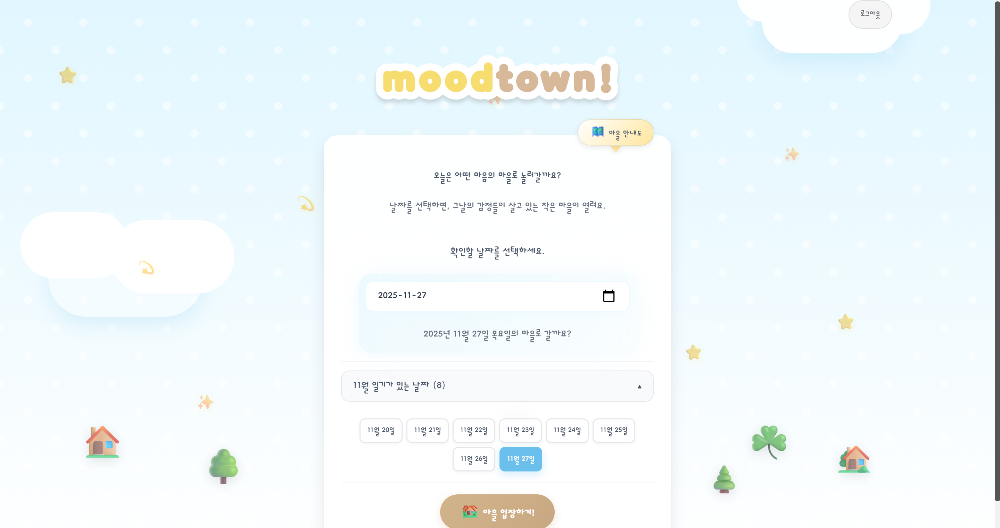
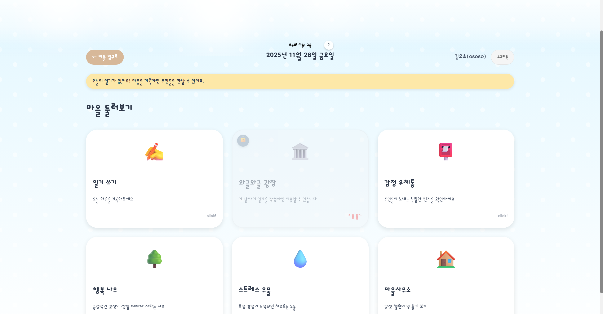

# moodtown 🏘️

moodtown은 사용자의 일기를 AI가 분석해 7가지 감정의 주민 캐릭터로 시각화하고, 감정 기반의 마을을 성장시키는 인터랙티브 다이어리 플랫폼입니다.

**배포 링크**  
[☘️ Go to moodtown!](https://moodtown-three.vercel.app/)  

**테스트 계정**  
**ID**: ososo /  **PW**: moodtown  
👉🏻 로그인을 하면 예시 데이터를 통해 moodtown의 구현 모습을 빠르게 확인해 볼 수 있어요!

## 📖 개요

moodtown은 단순한 일기 앱을 넘어서, 감정을 시각화하고 게임화 요소를 통해 사용자의 감정 표현과 자기 이해를 돕습니다. 지나치기 쉬운 감정을 돌아보고 나의 마음을 알아갈 수 있어요.

일기를 작성하면:

- 🤖 **AI가 감정을 분석**하고 (GPT-4o-mini)
- 👥 **감정 주민들이 대화**를 나누며
- 🌳 **행복 나무가 자라나고**
- 💧 **스트레스 우물이 차오르며**
- 💌 **주민들이 편지**를 보내는

감정 기반 소셜 게임형 일기 플랫폼입니다.

## 📸 기본 화면 스크린샷

### 로그인 페이지
  
~❥
### 홈 화면

~❥
### 마을 입구


---


## 🚀 빠른 시작

### 사전 요구사항
- Python 3.8 이상
- Node.js 18 이상
- PostgreSQL 데이터베이스
- OpenAI API 키

### 설치 및 실행

#### 1. Backend 설정
```bash
cd backend
python -m venv venv
# Windows: venv\Scripts\activate
# Linux/Mac: source venv/bin/activate
pip install -r requirements.txt
python -c "from db import init_db; init_db()"
python app.py
```

#### 2. Frontend 설정
```bash
cd frontend
npm install
npm run dev
```

자세한 내용은 [백엔드 가이드](docs/BACKEND.md)와 [프론트엔드 가이드](docs/FRONTEND.md)를 참고하세요.

## 🛠️ 기술 스택

- **Frontend**: React 19.2.0, Vite (Rolldown 기반)
- **Backend**: Flask 3.1.2, Python 3.x
- **Database**: PostgreSQL
- **AI**: OpenAI API (GPT-4o-mini)
- **ML**: scikit-learn (감정 분석), Gensim (Doc2Vec)

자세한 내용은 [시스템 아키텍처](docs/ARCHITECTURE.md)를 참고하세요.


## 🐻 핵심 컨셉

### 1. 감정의 시각화와 의인화를 통한 커뮤니케이션
추상적인 감정을 구체적인 캐릭터와 게임 요소로 표현합니다. 7가지 감정(기쁨, 사랑, 놀람, 두려움, 분노, 부끄러움, 슬픔)은 각각 고유한 색상과 성격을 가진 주민 캐릭터로 나타납니다. 감정의 의인화를 통해 자신의 감정에 더욱 친근하게 다가갈 수 있도록 합니다.

### 2. 게임화(Gamification)
일기 작성이 재미있고 지속 가능하도록 게임 요소를 추가했습니다:
- 행복 나무가 자라나고 열매를 맺음
- 스트레스 우물의 물이 변화함
- 감정 주민들이 대화를 나눔
- 편지와 메시지를 받음

### 3. AI 기반 분석
GPT-4o-mini와 ML 모델을 활용한 정확한 감정 분석:
- **GPT-4o-mini**: 최종 감정 분석 및 대화 생성 (실제 사용)
- **ML 모델**: 참고용 감정 분석 제공


## ⚙️ 작동 방식

일기를 작성하면 자동으로 다음 과정이 진행됩니다:

### 1. 🤖 AI 감정 분석
- GPT-4o-mini가 일기 내용을 읽고 7가지 감정에 대한 점수를 산출
- 각 감정은 0~100점으로 표시되며, 여러 감정이 동시에 존재할 수 있음
- 참고용으로 ML 모델 분석 결과도 제공 (비교용)

### 2. 👥 감정 주민 대화 생성
- 감정 분석 결과를 바탕으로 GPT-4o-mini가 감정 주민들의 대화 생성
- 각 주민은 고유한 성격과 말투를 가짐
- 일기 내용에 대해 주민들이 서로 의견 및 감정을 나누는 형태

### 3. 🌳 행복 나무 성장
- 긍정적인 감정(기쁨, 사랑, 긍정적 놀람/부끄러움)이 쌓이면 나무가 자라남
- 나무가 일정 단계까지 성장하면 열매가 열림
- 열매 수집을 통해 성취감 제공

### 4. 💧 스트레스 우물 변화
- 부정적인 감정(분노, 슬픔, 두려움, 부정적 놀람/부끄러움)이 쌓이면 우물에 물이 차오름
- 물이 가득 차면 넘치게 됨

### 5. 💌 감정 주민 편지
- 특별한 상황에 주민이 편지를 보냄

## 기술적 특징

### 하이브리드 감정 분석
GPT-4o-mini와 ML 모델을 함께 사용합니다:
- **GPT-4o-mini**: 최종 감정 분석 (실제 시스템 사용)
- **ML 모델**: 참고용 분석 (사용자가 비교 가능)

### 문맥 기반 감정 분류
"놀람"과 "부끄러움"은 문맥에 따라 긍정/부정으로 구분됩니다:
- **Rule-based 분석**: 키워드 패턴 매칭
- **GPT 기반 분석**: 문맥 이해
- 두 결과를 결합하여 최종 극성 결정

### 실시간 대화 생성
GPT를 활용한 자연스러운 캐릭터 대화:
- 각 주민의 고유한 성격과 말투 반영
- 감정 점수에 따라 주요 감정과 반응 감정 구분
- 일기 내용에 대한 다양한 관점 제공

### 유사 일기 검색
Doc2Vec 기반으로 과거 유사한 감정의 일기 찾기:
- 텍스트 유사도 + 감정 점수 유사도 결합
- 자기 이해와 감정 패턴 파악에 도움

### 캐시 최적화
모듈 레벨 캐싱으로 빠른 페이지 전환:
- 페이지 전환 시 즉시 데이터 표시
- 불필요한 API 호출 최소화

## 대략적인 프로젝트 구조

```
moodtown/
├── backend/                 # Flask 백엔드
│   ├── api/                # API 라우트
│   ├── services/           # 비즈니스 로직
│   ├── core/               # 공통 모듈
│   └── db.py              # 데이터베이스 연결
├── frontend/              # React 프론트엔드
│   └── src/
│       ├── pages/         # 페이지 컴포넌트
│       ├── components/    # 재사용 컴포넌트
│       └── utils/         # 유틸리티 함수
└── docs/                  # 문서
```

자세한 구조는 [프로젝트 구조](#)를 참고하세요.

## 📚 자세한 설명
#### 기능 및 로직
- **[주요 기능](docs/FEATURES.md)** - 주요 기능 설명
- **[게임 디자인](docs/GAME_DESIGN.md)** - 감정 마을/나무/우물의 게임 메커니즘  

#### 시스템 설계 구조 및 기술 
- **[시스템 아키텍처](docs/ARCHITECTURE.md)** - 시스템 아키텍처 구조
- **[프론트엔드](docs/FRONTEND.md)** - 프론트엔드 실행/설계 설명
- **[백엔드](docs/BACKEND.md)** - 백엔드 실행/설계 설명
- **[ML 모델](docs/ML_MODELS.md)** - 감정 분석/Doc2Vec 모델 설명
- **[API 레퍼런스](docs/API_REFERENCE.md)** - API 라우트 문서
- **[배포 가이드](docs/DEPLOYMENT.md)** - 배포 과정 설명

## 📝 라이선스

This project is licensed under the MIT License


## 📚 외부 리소스 및 참고 자료

이 프로젝트는 다음 외부 기술, 데이터셋, 라이브러리를 활용하여 구현되었습니다:

### 데이터셋
| 리소스 | 설명 |
|--------|------|
| AI Hub – 감성대화말뭉치 | ML 감정 분석 모델 학습용 한국어 감성 대화 데이터 |

### AI / 모델
| 리소스 | 설명 |
|--------|------|
| OpenAI GPT-4o-mini | 감정 분석, 대화 생성, 편지 생성 |

### 백엔드 라이브러리
| 리소스 | 설명 |
|--------|------|
| Flask 3.1.2 | REST API 서버 |
| Werkzeug 3.1.3 | WSGI 유틸리티 라이브러리 (Flask 의존성) |
| blinker 1.9.0 | 시그널 지원 (Flask 의존성) |
| click 8.3.0 | CLI 인터페이스 (Flask 의존성) |
| itsdangerous 2.2.0 | 안전한 데이터 직렬화 (Flask 의존성) |
| Jinja2 3.1.6 | 템플릿 엔진 (Flask 의존성) |
| MarkupSafe 3.0.3 | 안전한 문자열 처리 (Flask 의존성) |
| flask-cors 6.0.1 | CORS 처리 |
| psycopg2-binary 2.9.9+ | PostgreSQL 연결 |
| gunicorn 21.2.0+ | 프로덕션 WSGI 서버 |
| python-dotenv 1.2.1 | 환경변수 관리 |
| openai 1.0.0+ | OpenAI API 클라이언트 |

### 머신러닝
| 리소스 | 설명 |
|--------|------|
| numpy | 수치 연산 라이브러리 |
| scikit-learn 1.3.0+ | Logistic Regression 기반 감정 분류 모델 |
| Gensim 4.3.0+ | Doc2Vec 기반 유사 일기 검색 모델 |
| joblib 1.3.0+ | ML 모델 저장/로딩 |
| matplotlib 3.8.0+ | 데이터 시각화 (학습 스크립트용) |
| seaborn 0.13.0+ | 통계 데이터 시각화 (학습 스크립트용) |

### 프론트엔드
| 리소스 | 설명 |
|--------|------|
| React 19.2.0 | UI 구현 |
| react-dom 19.2.0 | React DOM 렌더링 |
| Vite (rolldown-vite 7.2.2) | 빌드 도구 및 개발 서버 |
| @vitejs/plugin-react 5.1.0 | React 플러그인 |
| eslint 9.39.1 | JavaScript 린터 |
| @eslint/js 9.39.1 | ESLint JavaScript 플러그인 |
| eslint-plugin-react-hooks 5.2.0 | React Hooks 린트 규칙 |
| eslint-plugin-react-refresh 0.4.24 | React Fast Refresh 린트 규칙 |
| @types/react 19.2.2 | React TypeScript 타입 정의 |
| @types/react-dom 19.2.2 | React DOM TypeScript 타입 정의 |
| globals 16.5.0 | ESLint 글로벌 변수 정의 |
| Dongle Font (Google Fonts) | UI용 커스텀 폰트 |

### 데이터베이스
| 리소스 | 설명 |
|--------|------|
| PostgreSQL | 관계형 데이터베이스 관리 시스템 |

### 배포 플랫폼
| 리소스 | 설명 |
|--------|------|
| Vercel | 프론트엔드 배포 |
| Railway | 백엔드 및 PostgreSQL 호스팅 |
