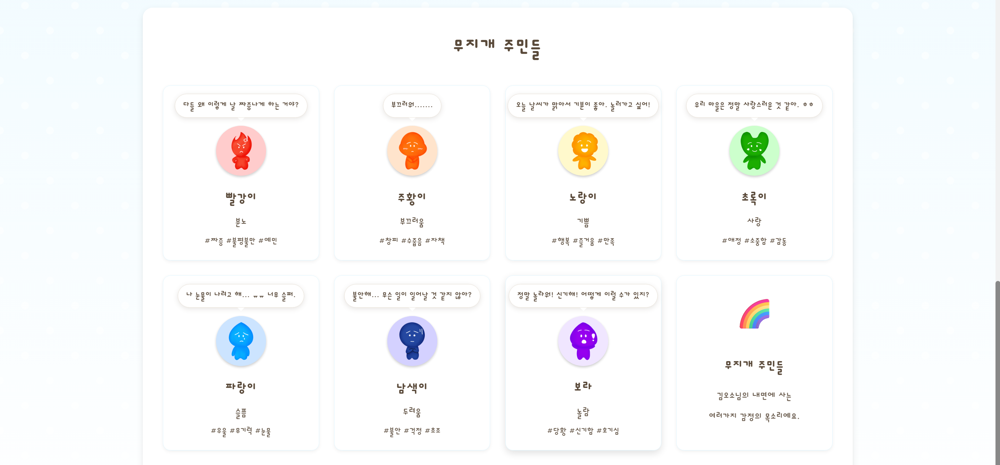
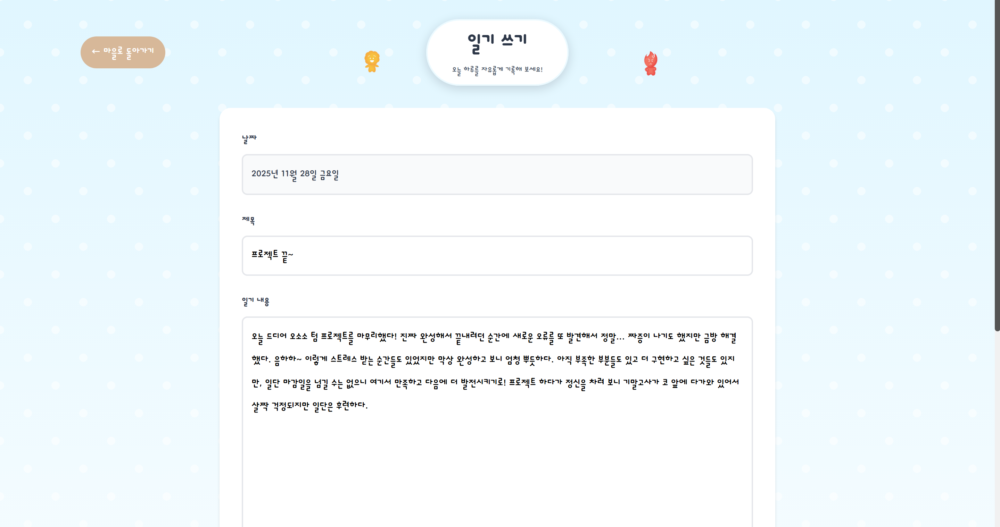
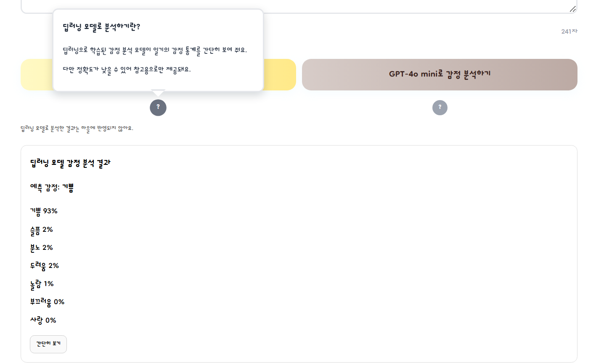
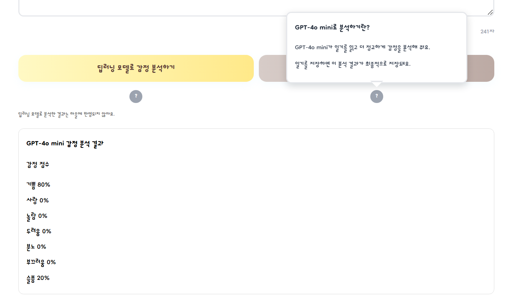
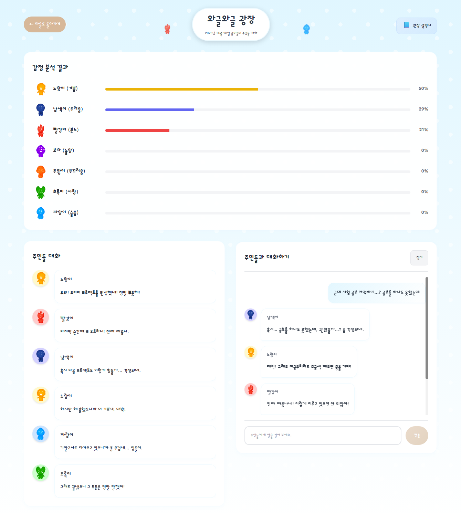
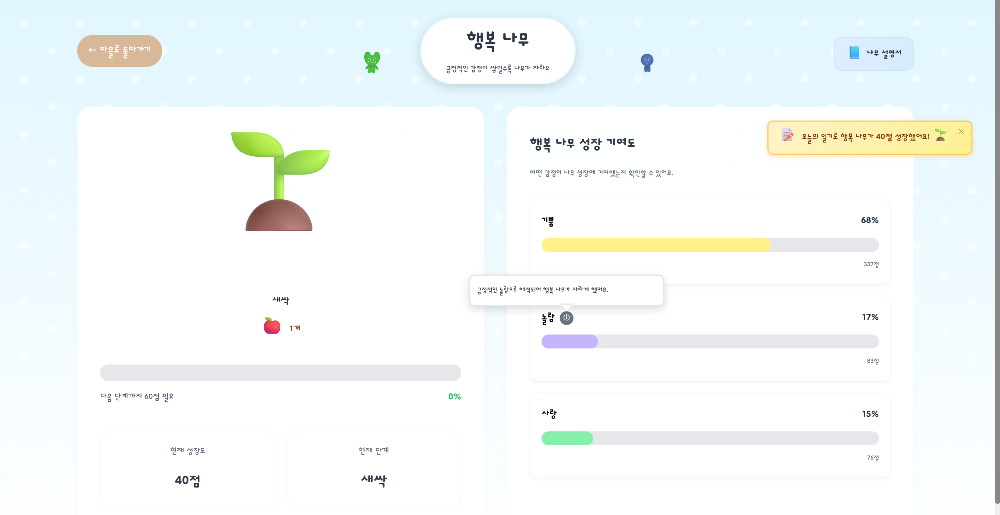
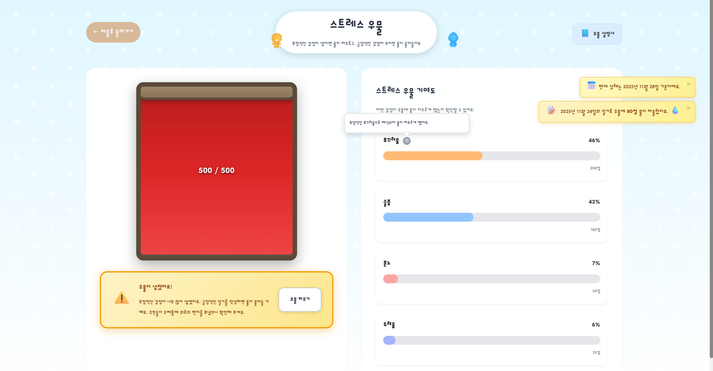
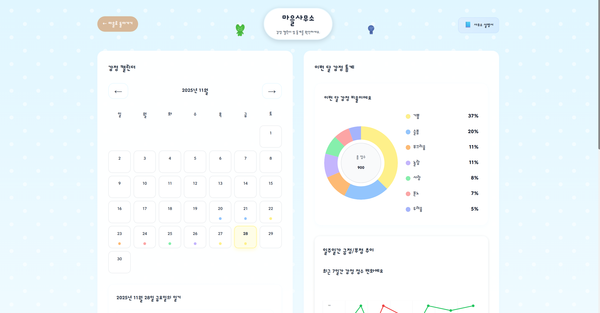
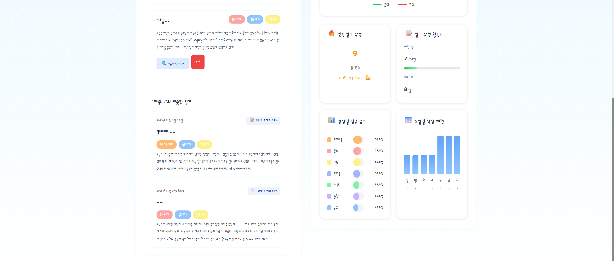
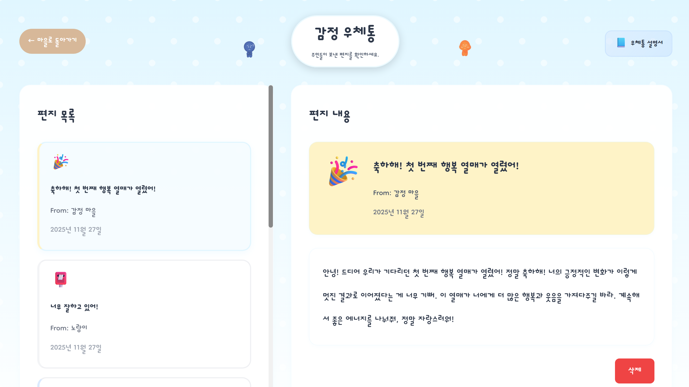

# FEATURES
moodtown의 주요 기능에 대해서 설명합니다. 

## 무지개 주민
각 감정마다 고유한 캐릭터가 있습니다:

- **빨강이** (분노): 화남, 짜증, 불평불만을 나타내는 주민
- **주황이** (부끄러움): 수줍음, 자책, 창피함을 나타내는 주민
- **노랑이** (기쁨): 즐거움, 행복, 신남을 나타내는 주민
- **초록이** (사랑): 애정, 우정, 따뜻함을 나타내는 주민
- **파랑이** (슬픔): 우울함, 무기력함, 속상함을 나타내는 주민
- **남색이** (두려움): 불안함, 걱정, 초조함을 나타내는 주민
- **보라** (놀람): 충격, 신기함, 호기심을 나타내는 주민  
 

각 주민은 고유한 색상, 성격, 말투를 가지고 있으며, 일기에 대한 반응도 다릅니다.  
사용자는 자동 생성된 답변을 통해 주민과 채팅하며 대화할 수 있습니다.  
   
## 1. 📝 일기 작성
### 기본 기능
- **날짜별 일기 작성 및 관리**: 특정 날짜에 일기 작성, 수정, 삭제 가능
  - 원하는 날짜를 선택해서 일기를 작성할 수 있습니다
  - 일기를 수정 및 삭제하면 그에 따라 마을 상태도 함께 변합니다
- **감정 분석**: ML 모델 또는 GPT-4o-mini를 이용한 감정 분석
  - #### 감정 분석 옵션

    | 분석 방식       | 용도    | 속도 | 정확도 | 실제 시스템 적용 |  
    | ----------- | ----- | -- | --- | --------- |  
    | ML 모델       | 참고용   | 빠름 | 낮음  | ❌         |  
    | GPT-4o-mini | 메인 분석 | 보통 | 높음  | ✔         |  
    - ML 모델의 분석 결과는 정확하지 않으므로로 참고용으로 제공
    - GPT-4o-mini가 분석한 결과가 
#### 일기 쓰기 화면
  

#### ML 감정 분석 / GPT 감정 분석 미리 보기

  
  

  
   

## 2. 🏛️ 와글와글 광장
각각 다른 감정을 나타내는 무지개 주민들이 일기 내용에 대해 대화를 나누는 공간입니다.
### 기본 기능
- 감정 분석 결과를 확인할 수 있습니다
- 일기의 내용과 감정 분석 결과를 토대로 주민들이 이야기를 나눕니다
- 사용자는 마을의 주민들과 채팅하며 소통하고 상호작용할 수 있습니다
- 대화는 GPT-4o-mini가 생성하며, 각 주민의 고유한 성격과 말투가 반영됩니다
#### 와글와글 광장 화면
  
   

## 3. 🌳 행복 나무
긍정적인 감정이 쌓이면 자라나는 나무입니다.  

### 기본 기능
- **긍정적인 감정**: 사랑, 기쁨, (긍정적) 부끄러움, (긍정적) 놀람
  - 놀람/부끄러움은 문맥 기반으로 긍정/부정으로 나뉘어 계산됩니다
- 나무가 성장 단계를 거쳐 완전히 자라면 행복 열매가 열립니다
- 행복 열매가 열리면 주민들이 축하 편지를 보내고 스트레스 우물 물이 줄어듭니다
#### 행복 나무 화면
  
   

## 4. 💧 스트레스 우물
부정적인 감정이 쌓이면 차오르는 우물입니다.

- **부정적인 감정**: 분노, 슬픔, 두려움, (부정적) 놀람, (부정적) 부끄러움
  - 놀람/부끄러움은 문맥 기반으로 긍정/부정으로 나뉘어 계산됩니다
- 물이 가득 차면 넘치고, 주민들이 위로 편지를 보냅니다.
- 하루 일기에 긍정적 감정만 있을 경우 물이 줄어듭니다.
- 행복 열매가 열리면 물이 줄어듭니다.  
#### 스트레스 우물 화면(넘치기 전후)

  
  

  
 

## 5. 🏠 마을 사무소
일기 아카이브, 다양한한 통계, 감정 캘린더, 유사한 일기 찾기 등의 기능을 제공합니다.

- **감정 캘린더**: 날짜별로 지배적인 감정을 색상으로 표시하는 캘린더 뷰입니다. 한눈에 감정 패턴을 확인할 수 있습니다.

- **이번 달 감정 통계**: 한 달간의 감정 비율을 도넛 그래프로 나타냅니다.
- **주간 긍정/부정 추이**: 긍정 감정과 부정 감정의 추이를 선 그래프로 시각화합니다.
- **감정별 평균 점수**: 각 감정의 평균 점수 표시합니다. 어떤 감정이 가장 많이 나타나는지 확인할 수 있습니다.
- **요일별 작성 패턴**: 요일별 일기 작성 빈도를 분석하여 언제 일기를 가장 많이 쓰는지 파악할 수 있습니다.
- **연속 일기 작성/일기 작성 활동도**:
일기 쓰기 빈도 현황을 통계로 제공합니다. 

- **유사한 일기 찾기**
  - Doc2Vec 모델 기반으로 선택한 일기와 유사한 감정/내용의 과거 일기 검색
  - 텍스트 유사도 + 감정 점수 유사도를 결합하여 정확도 향상
  - 비슷한 상황에서의 감정 변화 추이 확인 가능
  - 자세한 내용은 [ML 모델 문서](ML_MODELS.md#유사-일기-검색-모델)를 참고하세요.  

  
    
 

## 6. 📬 감정우체통
감정 주민들이 보내는 편지를 확인할 수 있습니다.

- 하루에 70% 이상인 감정이 있다면 해당 주민으로부터 편지가 옵니다
- 행복 나무에 열매가 맺히면 축하하는 편지가 옵니다
- 스트레스 우물의 물이 넘치면 위로하는 편지가 옵니다

[← README로 돌아가기](../README.md)